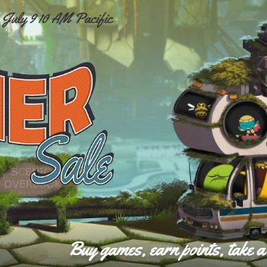
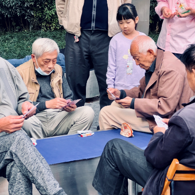
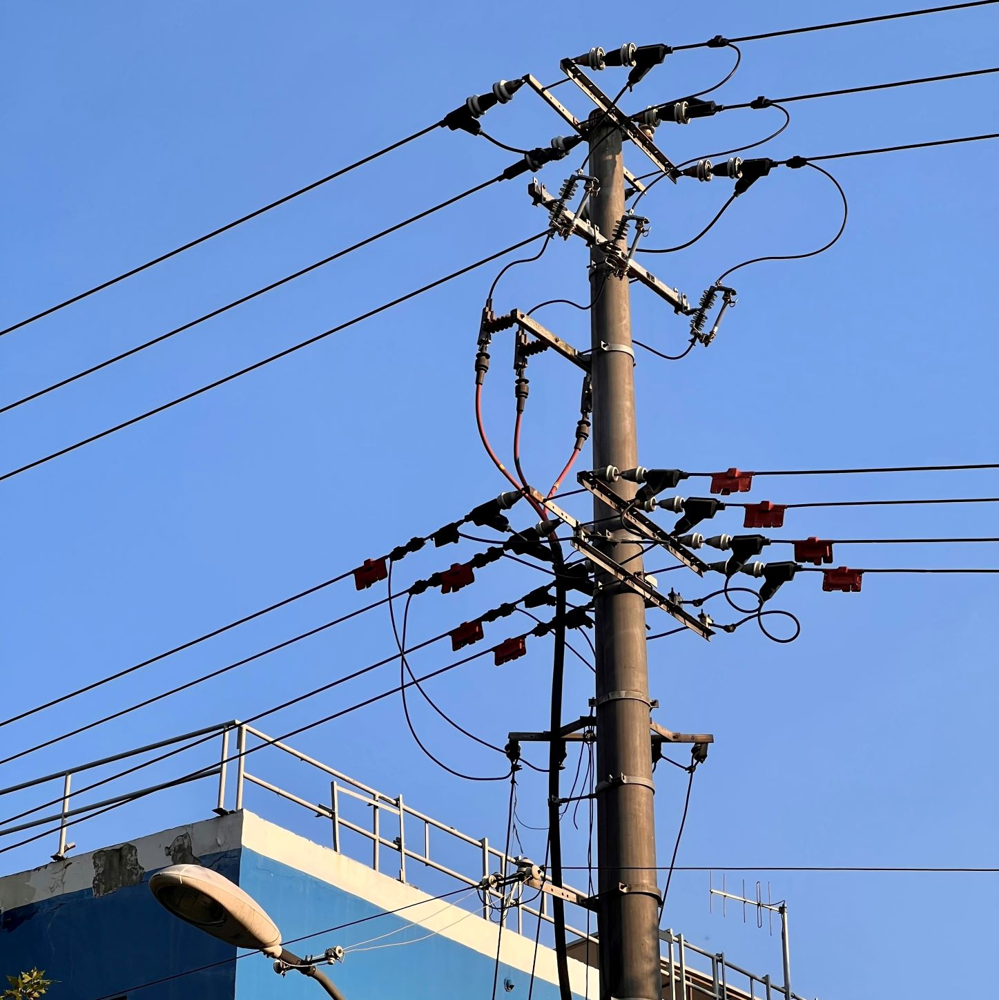

---
hide:
  - navigation
  - toc
---
#

<h1>艇</h1>
<h2>仔粥……</h2>
<h4>滾燙熱湯，冰冷生蠔；生猛海鮮，值得啖一陣</h4>

---

  

    <h2>下弦之伍</h2>
    <h4>搞錯，但都是蜘蛛啦</h4>
  

  

    <a href="https://herointene.github.io/tech/steam-crawling-python/">
      
      

        <h4><b>爬取Steam游戲榜單</b></h4>
        
分析的第一步：打開Python！

      

    </a>
  

<h1>寫好</h1>

儘請期待 Photographic Project: 333

  

    <h2>我説：</h2>
    <h4>你不好好學習，將來怎麽養活自己？</h4>
  

  

    <a href="https://herointene.github.io/talk/about-life-choices/">
      
      

        <h4><b>關於選擇</b></h4>
        
那年是七年級的夏天，我第一次明白：只要擁有白石洲一棟樓，一世就都不用愁。

      

    </a>
  

  

    <h2>多喝熱水。</h2>
  

  

    <a href="https://herointene.github.io/poems/ch1/celeste/">
      
      

        <h4><b>Celeste</b></h4>
        
看到流星，記得按A鍵許願

      

    </a>
  

  

    <h2>秋末 冬至</h2>
    <h4>書寫夢境裏的湯圓大軍</h4>
  

  

    <a href="https://herointene.github.io/talk/digital-sweetdumpling/">
      
      

        <h4><b>電子湯圓</b></h4>
        
“刺繡五紋添弱線，吹葭六管動浮灰。”

      

    </a>
  

<h4 style="text-align: center; font-size: 10px; color: gray;">更多首頁導覽内容，敬請期待下一次更新……</h4>
