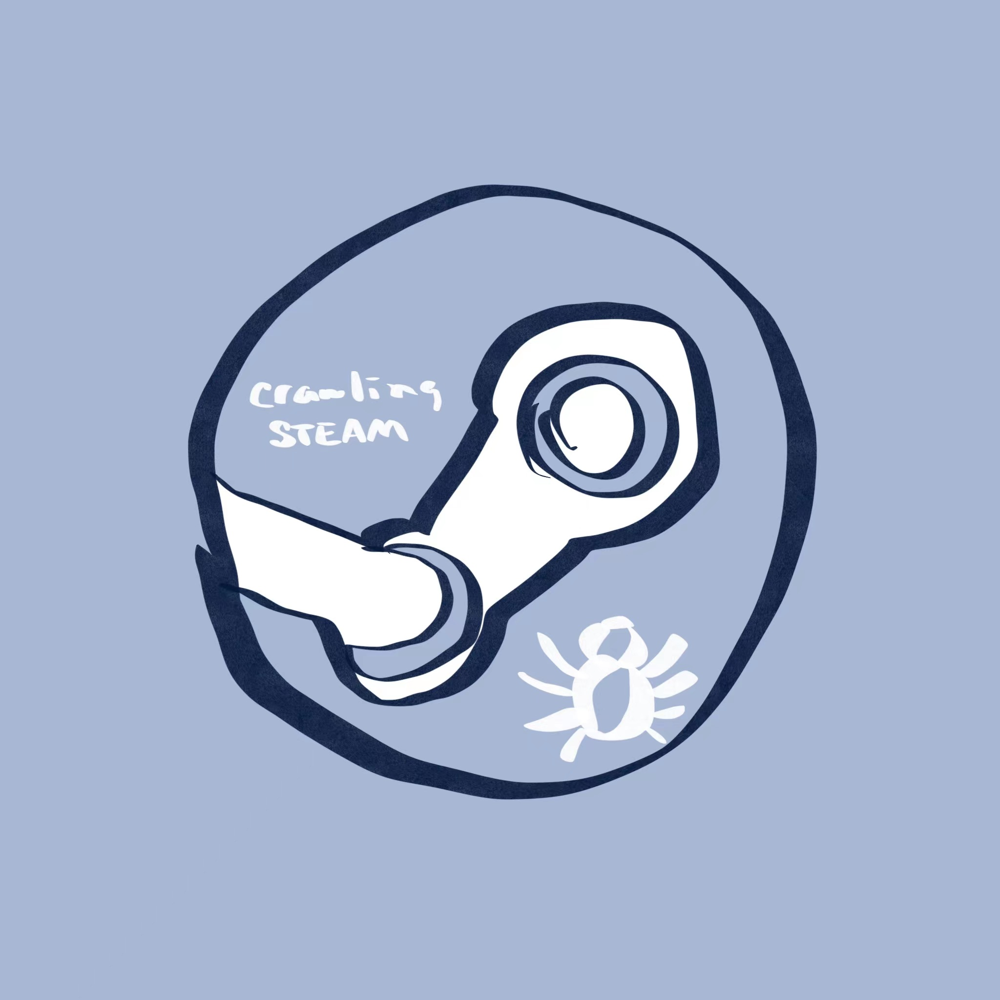

---
hide:
  - navigation
  - toc
---

  

    
    
滾燙熱湯，冰冷生蠔；生猛海鮮，值得啖一陣

  

  

    

      <h2>搭建 Mkdocs </h2>
      <h4>簡約的個人網站搭建教學，純粹心得</h4>
    

    

      <a href="./tech/mkdocsbuild">
        
        

          <h4><b>Mkdocs 搭建：快速導覽</b></h4>
          
輕鬆閲讀，快速上手

        

      </a>
    

  

  

    

      <h2>下弦之伍</h2>
      <h4>搞錯，但都是蜘蛛啦</h4>
    

    

      <a href="./tech/steam-crawling-python">
        
        

          <h4><b>爬取Steam游戲榜單</b></h4>
          
分析的第一步：打開Python！

        

      </a>
    

  

  

    

      <h2>加點個性</h2>
      <h4>這個頁面好看嗎？</h4>
    

    

      <a href="./tech/mixedmkdocs">
        
        

          <h4><b>Mkdocs 混合頁面</b></h4>
          
markdown+HTML+CSS

        

      </a>
    

  

  

    

      <h1>TapWater</h1>
      
再來七杯自來水，持續更新...

      

        <a class="btn" href="./poems/preface">
          > 擰開
        </a>
      

    

    

      <h1>KanaKill</h1>
      
一個日本五十音練習游戲

        

          <a class="btn" style="background-color: #FDD9D9" href="https://kanakill.netlify.app" target="_blank">
          > 努力
          </a>
      

    

  

  
  
 
    

      

      

      <h3>模仿、抄襲、致敬，生活。</h3>
      <h4>主頁面敬請期待</h4>
    

    

    <iframe src="//player.bilibili.com/player.html?aid=925581718&bvid=BV1YT4y1372J&cid=188741128&page=1" scrolling="no" border="0" frameborder="no" framespacing="0" allowfullscreen="true" width= "540px" height="360px"> </iframe>
    

  

  

    

      <h2>我説：</h2>
      <h4>你不好好學習，將來怎麽養活自己？</h4>
    

    

      <a href="./talk/about-life-choices">
        
        

          <h4><b>關於選擇</b></h4>
          
那年是七年級的夏天，我第一次明白：只要擁有白石洲一棟樓，一世就都不用愁。

        

      </a>
    

  

  

    

      <h2>那晚的流星……</h2>
    

    

      <a href="./talk/grant-wishes">
        
        

          <h4><b>許願</b></h4>
          
看到流星，記得按A鍵許願

        

      </a>
    

  

  

    

      <h2>秋末 冬至</h2>
      <h4>書寫夢境裏的湯圓大軍</h4>
    

    

      <a href="./talk/digital-sweetdumpling">
        
        

          <h4><b>電子湯圓</b></h4>
          
“刺繡五紋添弱線，吹葭六管動浮灰。”

        

      </a>
    

  

  <h4 style="text-align: center; font-size: 10px; color: gray; margin-bottom: 0;">更多首頁導覽内容，敬請期待下一次更新……</h4>

