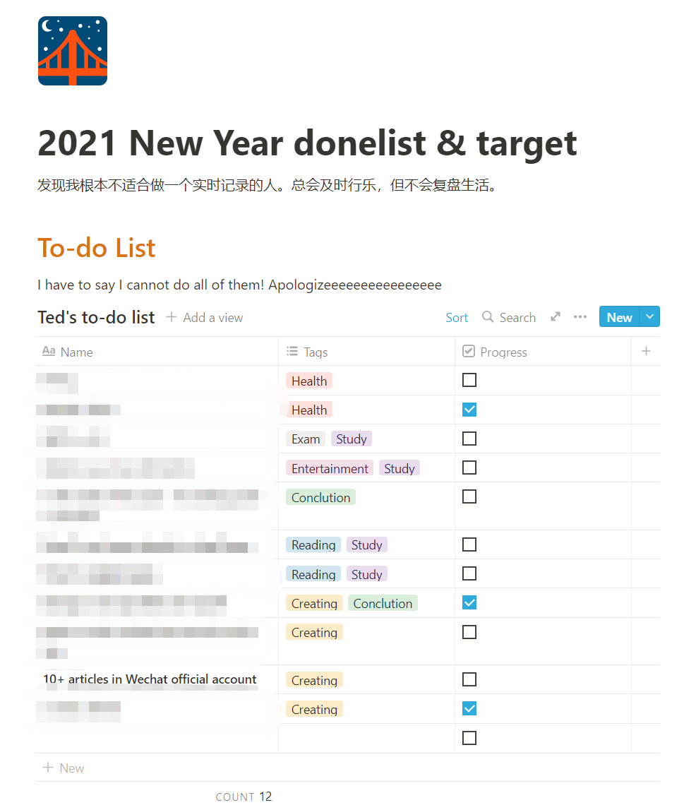
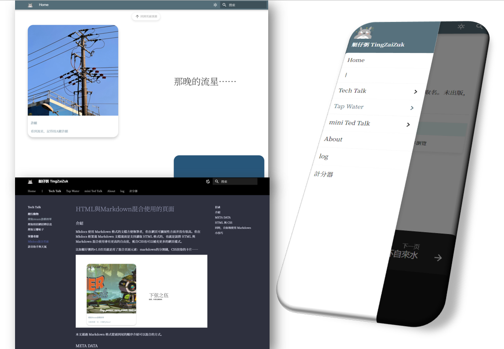
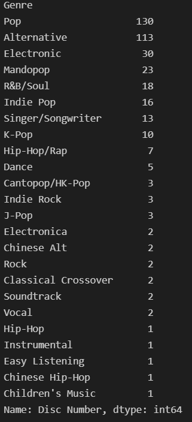

# 米綫、時空飛船與總結

 

“我以爲我在年初寫下了目標就一定會去執行，笑死。”

---

## 前言

曾經、很久以前、也不算很久——362天前，我寫下了人生的第一篇新年計劃。

然後，在這361天，我再也沒有打開過它。等到我今天終於鼓起勇氣點開，審視那個年初如此荒謬的自己——等等，那樣的荒謬不就跟我現在一樣嗎？

“我這一年最大的變化就是：我人生的計劃在不斷地在變化，以至於年初定下的許多目標失去了他們及時性的意義。”

我竟恬不知恥寫完剛才那句説辭！

當我打開它時，我發現當時的我竟然寫了這句話：

“發現我根本不適合做一個實時記錄的人……”

{width=300px}

原來自己竟然這麽瞭解自己，在剛開始寫的時候就預知了to-do-list最終被我抛棄的下場。我流下（鰐魚的）眼淚，給勉强完成的目標打上了虛僞的勾。

我還寫了今年要在公衆號發至少十篇文章。是我不配，今天才是今年第一次登入公衆號後臺。看到去年真的寫了十篇文章，心裏很不是滋味（假的），曾經那個對創作飽含熱情的人（怎麽可能），如今卻變成下班回家就躺著的人（嗯嗯）。

所以，在年末，我主動出擊，點開收藏欄裏的後臺入口，掃碼登入，新建文章，開始碼字。

## ---==這一年我究竟做了什麽==---

### 學習&&工作

這一年的學習之路是從下半年開始。上半年，我在《足球經理2021》裏度過了13年的主教練生涯；在《暗黑地牢》裏度遭受了60個星期的精神打擊……

到了下半年，我決定不再墮落了。我關掉了暗黑地牢，

因爲我通關了。

我又關掉了足球經理……放空了半個小時，

又重新打開……

但由於鼓起勇氣建立起强大的作息調整計劃，我真的減少了將近一半的游戲時間。我學習了前端語言，兩個月後開始搭建我的個人網站。

現在我的個人網站已經成型，也搬運了一部分公衆號的文章過去，又在那邊更新了一些新的文章。總的來説，内核大改進不會讓人覺得有過多變換，但包裝大改進會讓人愉悅許久。比如我就經常在網站首頁發呆。那種感覺如同在因紐特人的冰屋外點燃一堆柴火，躺在雪地上看著北邊的極光。我的首頁就是我自己的賽博極光。

我學會基本的HTML，和CSS樣式表，JavaScript構造一些簡單的交互邏輯；選擇了一個比較簡約的框架在某個周末部署到了GitHub上面。由於有了python的基礎，我發現許多編程語言實際上都是差不多的東西，所以精通一門編程語言要遠遠大於對市面上所有流行語言都學了個大概，因爲有許多邏輯是可以照搬到另外一個編程語言之中的。但僅限於編程語言——對於文化上的語言，那真的是多多益善——單就從學習編程語言來説，我在看英文文檔時放慢了很大的步伐，吃了好多文化的虧……

{ width=200px align=right }經歷了白天工作晚上學習的這段時間，我學會如何去找出那一行出錯的根源代碼，這也稀釋了剛出校門進入職場的我一開始的那股較真的勁。一直以爲全球最大的公司裏應該是每個問題都有完美的解決方案與精妙的部門之間的過渡。沒想到解決問題的速度遠超我的想象，直到我試圖找出那一行代碼——那不是一行代碼，那是塞納河某架橋上的情人鎖，緊緊相扣連成巨大的根源代碼塊，不知道哪個才是另一個的開端，根本無從下手；但當這艘諾亞方舟還在運轉，這點永遠不會釀成大禍的複雜小問題也就沒人會在意（就像先輩説的那樣，如果代碼運行正常，你就不必再回去改成自己滿意的模樣……）。於是我釋懷了，因爲我糾結的地方并不會影響照常發給我的薪資。

工作原因，我從零開始學習Tableau。其實之前接觸過微軟的PowerBI，所以又發現有許多邏輯是相通的。區別在於我學得不精，看到同組的大神改出各種函數、各種模塊合爲一體的看板，我直呼快給他加錢。每次看到他的看板，我就會覺得那是家後面的野山。那樣偉岸與難以逾越，在還沒開始模仿的時候就已經打消了學習的念頭。但又不能不前進，那種糾結又仰慕的進退兩難就是學習的痛苦之處吧。

### 玩樂&&創作

今年重新訂閲了Apple Music，從零開始組成新的歌單。幾個月的時間挑了總共十幾個小時的自己喜歡的歌曲，再一一評分排序，總結聽歌品味。在這裏，我必須十分肯定的説出iOS的Apple Music是蘋果最爛的一款原生應用，MacOS的音樂應用都比iOS的真的好到不知道哪裏去了。

整理一下我今年最喜歡的專輯：

 

|專輯名字|歌手|發行年份|播放次數|
|:-----:|----|-----------|-------|
SOUR | Olivia Rodrigo |2021| 58|
Things I Never Said| Oceanator| 2020| 102|
Head of Roses| Flock of Dimes| 2021| 68|
我用什么把你留住| 福禄寿| 2021| 66|
Rare (Deluxe) |Selena Gomez| 2020| 56|
Positions| Ariana Grande |2020 |50|
lil kiiwi (Deluxe)| Kiiara |2020 |38|
Jubilee |Japanese Breakfast| 2021| 25|
CHEF TALK| Lil Cherry & GOLDBUUDA |2020 |85|
Trying: Season 2 (Apple TV+ Original Series Soundtrack)| Maisie Peters |2021| 19|
333| Tinashe| 2021| 18|

 

今年最喜歡的歌手是Banks。雖然今年沒有新專輯，翻看了她的音樂節演出，實實在在地被吸引住了。我覺得另類音樂就需要像她寫那樣，不在爲了另類而另類，而爲了在私人領地裏宣泄，無畏他人不明白。

今年發現了好多Z世代的女歌手，比如參與過許多歌手創作的Maisie Peters，華裔混血的Griff，感覺明年格萊美能拿2座的Olivia Rodrigo。

感覺在挖掘歌曲的時候，也同時在審視自己。什麽歌我存進資料庫后每次卻都跳過，什麽歌我百聽不厭；等到自己下載一份歌單的資料下來，才知道自己日積月纍填充數據后展現出對自身喜好的規律性：

其實分析自己的歌單還蠻有趣的，鑒於大陸各大音樂平臺都有自己的年終總結，我決定有機會也分享一下我用python/Excel分析自己的歌單的文章。

---

整理一下我今年寫的最喜歡的詩：

??? 袁鳳嵐

    預想

    你在我的周末計劃内

    晴天，湖邊——

    握著你巡禮於每座古宅前

    一起在新天地

    在北外灘 但

    /

    所有與你滾燙的内心相匹配的

    所有我向來便是小心翼翼的

    在空空蕩蕩的郵箱内找尋不到蹤跡了

    沉默賜予我休息日不再出門走動

    明明清楚但又不明白的短缺的不只有

    芯片、愛戀——

    我的遠峰藍，你怎麽還不發貨？

    *2021.10.30*

    /

        今年，我換了iPhone13Pro。因爲沒有在首發的夜晚等待，導致我要等待多一個月。
        在那個月我每天上班都是小碎步進公司查看今天發貨了沒有：沒有，沒有，還是沒有。
        等到他發貨的時候，顯示周末會到辦公室。

        想起之前的一次蘋果寄送到辦公室的經歷，因爲那天辦公室沒有人所以推遲到周一，
        沒有指派派送員之前又無法短時間内變更地址——那我不就在周末錯過迎接它的到來了？

        等待好辛苦，像是準備回國的男朋友突然因爲omicron variant在登機前被取消了航班，
        打長途電話回來收聽到消息的女生。
        這種感覺就像是今年，各種美好遐想與浪漫計劃，在等待不管是疫情消散或是就業機會的過程中
        頻繁出現變數——
        而自己只能面對錯過，面對失落，面對與預想恰反的情況，那種苦笑的感覺念念不忘，不敢再有。

??? 緊急想念
    你是否

    胡亂地把衣服扔向那椅子，

    像當初一樣 跳過了相擁？

    快進式播放愛情劇，

    狼吞虎嚥 划動屏幕？

    /

    有時候

    翻看你的詩集時不小心合上眼；

    窗前向日葵面對著我，

    拋開無法相遇的時空，

    與虛偽的道德，

    我只剩下老派的愛。

    *2021.9.1*

    /

        來上海一年多了。回想起來當初做這樣的決定，現在真的還會撲哧一聲笑出來。
        是覺得可笑，因爲我難得能鼓起勇氣，前往新的地方，或者說跳出舒適區。
        詩裏的上下部沒有一句形容我自己，但完全符合我在面對兩個不同境遇時保持那憐憫、愚蠢又懦弱的心。

[更多短詩在這裏](../poems/preface.md)

 

### 生活&&存在

我對上海的天氣十分滿意，同時對上海的空氣十分不滿意。回想了一下，自己在南回歸綫住了太久，忘記了什麽是冬天；再回想了一下，自己在南回歸綫住了太久，看到遠峰藍就在陸家嘴上空的時候還覺得不夠藍。
我活得像是一個肥宅探險家，每隔一段時間就要去新的城市宅著。剛來的時候，還以爲自己可以逛遍長三角，長假直奔内蒙古，結果整天在家看谷歌地圖。從落地就隔離，一坐飛機一不小心就要測核酸，上班都要看健康碼。總以爲自己生活的年代有些特殊，但每一代人何嘗不也這樣覺得呢。

這兩年，減少了游玩的機會，減少了團聚的機會，讓我對親情友情的認知更加豐富了。如果按照計劃，今年元旦我應該也是繼續在出租屋對著電腦發呆。這雖然也是我舒服的姿勢，但我更期待在某一條宇宙綫裏的我們都彼此團聚，不需擔心未來的規劃。長期宅家也增加了許多自我思考的方式，與此同時我的健忘程度卻大大增加。感覺自己比以前更懂得與自己和解，不過多糾結與後悔。每當與舊友聊起過往，我腦海裏都會渲染出一個幼稚的人再穿越回過去。

 

### 總結

如果還記得我的標題，“米綫，時空飛船與總結”，會發現我通篇沒有談及前兩樣。是的。今年大概也是如此，在總結之前，總想著自己今年可以拼造一艘厲害的時空飛船，卻每天在吃著米綫，跟蝸牛一樣的速度擰螺絲。但加了個總結在我的標題之後，今年就假定自己完成了大概三分之一吧。

我相信2022肯定充滿前所未有的挑戰。也願我的所有朋友十分健康且幸福。

*2021.12.31*

 