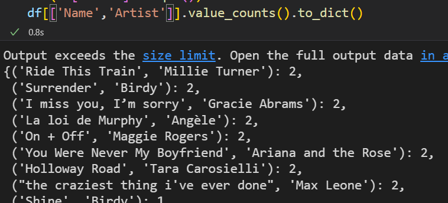

---
tags:
- sharing
---
# 二叠紀的風鈴聲 | 2022年終總結

	這是一篇個人的2022年終總結。

本想寫完標題就匆匆閉眼等待明年的到來，但在灰冷的日子裏從電視臺傳來卡塔爾前方梅西奪冠的畫面，我覺得可以再給這個世界一個改過自新的機會。

上半年是我最驚心膽顫的，我甚至認爲精彩的故事可以讓我寫出一篇短片小説，讓我終於意識到：比親身經歷“後怕”的事情更可怕的是“後怕的事情”與下一件“後怕的事情”是環環相扣的。但在這些環環相扣的鎖鏈中又有許多溫暖的幫助與問候，所以我的心態仍然健康在綫，沒有出現窗臺的向日葵對我説話的現象。

總的來説，我上半年辭去了人生第一份工作，下半年也從工作重新回到了學習的生活中。現在看起來這個決策算是成功執行并且進展順利的，所以下半年是我這三年來最舒心的時光。重返校園對我來説跟一直處於升學的狀態是不一樣的，這次我更加有計劃性地學習，也知道爲了什麽而學習了。

今年沒有時間寫作，文筆已經大大下降了，也沒有寫詩，甚至寫代碼這件事都空了大半年。我相信明年又是艱苦的一年，我又需要像2020年一樣，面臨在失業大浪潮中開始尋覓適合自己的工位這件事。

## 工作與學習

如上所述，我辭掉了上海蘋果的工作。原因是我想在新的地方開始新的生活。一想到離開蘋果，我是萬般地捨不得，可能第一份工作就是這樣子，當成初戀看待。但我又想象不到我在這裏安家立業的樣子——輾轉反側就是想不通，不是這裏不好，是一種説不出來的感覺；有點像薄荷巧克力。但這段分手來得太新鮮了：爲了回香港，辭職的時候在十幾平方米的會議室跟 leader 側著會議桌面對面，中間沒有桌椅相隔，要求提早 lastday 使我嘴唇發抖坐立不安；甚至最後一天都因爲疫情防控緊急撤離無法跟所有好朋友同事們當面告別，第二天收拾搬家行李，第三天趕在深圳封城前一天飛回深圳（當時的政策是在粵住滿14天可以不用在港居家隔離）……一切都很匆忙，像是在這個特殊的時期才有的期間限定薄荷巧克力，被逼著吃下去后發現滿是芥末。

於是一年半的職業之路就暫告一段落了；但學習沒有停止。還記得去年我從 HTML CSS JavaScript 開始學起，現在已經可以完成用 Vue 搭建數據平臺了。我很喜歡我這種漸進式的學習方式，邊學邊做自己想要的網頁 app，從易到難但自己的需求一個都沒有忽略掉，既帶挑戰性又有滿足需求的興奮感。年底參加了一個人才市場活動，有個公司 HR 問我求職之路的夢想是什麽，我説全棧工程師吧。但這是不是我的理想我還不得而知，我認爲我不是“純理性”的人，想得到某種東西必然要放棄掉一些身上的特質，我可能還太年輕太沒見過世面生活太充裕了，我做不到；像我想象自己在上海繼續打拼的樣子——還是沒有想象到。

我另一條學習之路是日語。跟我熟悉的人都知道我是沒有語言天賦的，甚至說普通話有時候都不知道自己想表達什麽；所以別人在我面前說自己看動漫學來的日語在我看來十分的欠揍，因爲我也看了十幾年的動漫，我也曾想跟著動漫學日語，可是完全學不會。但因各種“機緣”之下，我不知忽然頓悟似的想學日語了。於是我從4月開始學習日語，再到12月考了N3——對我來説已經很神奇了，我竟然能做到跨越記憶五十音這個十幾年的障礙！

## 音樂與創作

今年我仍然保持聼新專輯的習慣。總體沒有去年精彩，但是還是有幾張百聽不厭的，比如泰勒的午夜，風格統一且優雅，助我學習效率 Max。還有今年的新女團 New  jeans，如何說呢，他們都恰好在我的審美觀裏暢泳。但我聼最多次的是 Angele，我很少聼法語歌，因爲大多數除了嘻哈之外那些 pop music有種憂鬱的感覺；而她的歌竟然是憂鬱中帶著曖昧，真的無法自拔。

|專輯名字|歌手|發行年份|播放次數|
|:-----:|:----:|-----------|-------|
|Nonante-Cinq|Angèle|2021|173|
|Midnights (3am Edition)|Taylor Swift|2022|8|
|LÜCY|LÜCY|2022|69|
|NewJeans 1st EP 'New Jeans'|NewJeans|2022|30|
|The Happy Star|Lexie liu|2022|19|
|ONE LIFE ONLY|萬妮達|2022|3|
|white light - EP|emie nathan|2021|63|
|visions|milet|2022|99|
|CAPRISONGS|FKA twigs|2022|20|
|Malleable|Max Leone|2021|24|

Ofelia K 2016年的 Chaos Cave - EP 也是我經常單片循環的專輯。有時候覺得等到多年後才找到這麽好聽的歌曲全是我的錯，可能我多聽幾次能幫助歌手更有動力出新歌曲……

有時候聽到好聽的歌曲會隨口叫上 Siri 幫我加入到資料庫，但等到分析的時候才發現自己竟然有十幾首重複的歌曲：本來如果是同一首歌，那麽 Siri 會提示我這首歌已經在資料庫裏；但同一首歌被收錄在不同的專輯會被記爲兩首歌，於是這便產生了概率相當低的情況：
1. 我在加入這首歌之後又聼到的歌
2. 而 Apple Music 剛好給我推了另一張專輯收錄的歌
3. 而我認爲“好聽”并且“沒有印象加入過資料庫”的歌

這非常值得讓我將他們羅列出來，他們一定屬於慢熱的歌，因爲我第一次覺得好聽，但又沒有那麽深刻的印象；待到第二遍聼便覺得更好聽了。（很可惜沒有被我加入過3次的歌，也許是我記憶力沒那麽不好吧~）

*括號内，左為曲名，右為藝人名*

整理這些信息的時候無意中發現我在去年預測能拿2座葛萊美獎的 Olivia 獲得了7個提名與3個大獎。真希望她可以沉住氣繼續寫歌。

---

今年認識了很多新朋友。有一位聽了我做的音樂後説我真的要放到音樂平臺讓大家都聽見，我說真的嗎？

做音樂實際上只是我的興趣，因爲我不認爲它能養活我，所以只是把突發奇想的點子放入 GarageBand。但時間慢慢飛逝，回過神來文件夾裏已經有四五十個 demo 了，所以想要不然就完善一下隨便發一些吧？

於是我注冊了 SoundCloud，在上面傳了兩首，並讓它幫我推到各個音樂平臺。由於是庫樂隊做的，成品我甚至不太敢再點進去聼——因爲我的要求太高了，等到完善以後的作品我仍然不滿意。但我非常享受製作過程，因爲是我的興趣。所以今年大概沒有什麽其他成果可以分享在這裏，但是這兩首歌也算是另一個領域的起步吧。明年的我打算用上 Ableton Live，做一些新的嘗試。

[wulited in Apple Music](https://music.apple.com/us/artist/wulited/1649381611)

[wulited in 網易雲音樂](https://music.163.com/#/artist?id=54319144)

此外，我做了一個個人的 Landing Page（後來查了中文叫做“引導頁”），用於放在我的簡歷上。我覺得 landing page 或者像 linktree 是一個趨勢，不單只有名人才需要，每一個在互聯網中生活的人若都有一張名片似的東西，算是簡潔地自我介紹方式。

>像我這種内向到極緻的人，每次面試心裏都忍不住會想：我把網站丟給你了，你自己來看看我是怎樣的人吧，我是不會多説一句話的！

## 後記

這段後記是我在新的一年過了半個月後寫的。也就是説，我一直在思考如何用文字來結尾 2022 年。我感到無語，卻又覺得沒那麽糟糕。我總感覺我的 Time Zone 快要到來，希望這是我難能可貴的歷練時刻。

雖然後記是後來補上的，但是全文的主題還是跟標題一樣，聼著二叠紀的風鈴聲。二叠紀是古生代的最後一個時代，是三叠紀的前一時代；三叠紀又是侏羅紀的前一個時代。我希望這一年是萬物昌榮的再前奏，而吹起鈴聲的風可喚起我與你們對前程的憧憬。

（完）

