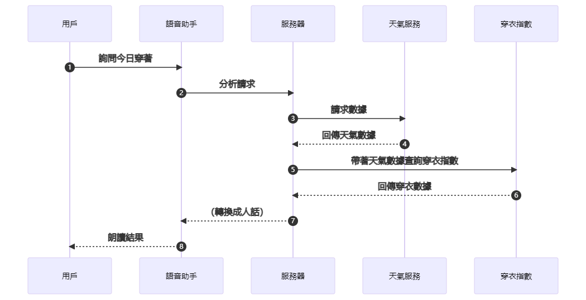
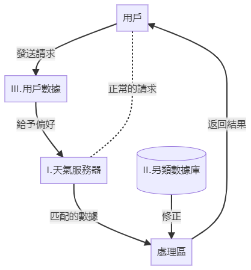

---
hide:
  -toc
---

# 語音助手的天氣分析思考

今天，我問小愛同學：“今天我要穿什麽衣服？”

答：今天有點冷，記得穿外套哦。

我又問面前白白胖胖的HomePodmini同樣的問題。

答：“這基於你當地的天氣。請嘗試問我‘今天天氣怎麽樣’。”

……？

我得到了一個毫無幫助的答復，一是我希望它可以直接告訴我今天穿什麽衣服，讓我不需要思考；二是我聽了廢話：既然穿衣情況根據當地的天氣，何不在後面順便説出天氣狀況呢？

不過基於Apple一向以來都是對步驟與隱私小心謹慎，用戶只能進行便利上的自我閹割。

不過小吱在身後給我扔了一件厚厚的hoodie：“穿上，別整天跟那群賽博女的唧唧喳喳。”

不過，我並沒有真正采納小愛同學的回答，這跟Siri最終的幫助程度其實是一樣的。這基於我可能不想穿外套，抑或是按我的身體健康，一件帽衫可能要比穿外套更加舒服。

於是突發奇想，是否可以改進語音助手的天氣流程，讓他完成一個複雜但準確的完美回答？

正常情況，人們的請求會經歷下面的步驟：

 

從語音助手開始往右走，就是語音助手幫你把數字轉換成你需要的行動的過程。人類擁有數據可以快速地走完這些步驟，但因爲每個人的差異性，所需要的答案也是千變萬化的，上圖就展示了傳輸結果的絕對單一性。貼合每個特定的人的需求所給的分析結果才是最適合這個人的，於是，每一個語音助手都需要瞭解每個使用者。那麽穿衣請求由簡到繁總共需要三步：

1. 基本數據對應的穿衣請求
2. 另類數據加强證明穿衣請求
3. 個人私隱信息所修正的真正穿衣需求

### 基本數據

這一步基本上匯集所有天氣相關的信息，包括溫度與濕度、紫外綫與雲層、風速變化等。在這裏所得到的穿衣請求應該能滿足超過半數的用戶的需求，但遠遠不夠，這也是目前大多數語音助手所到達的强度。

### 另類數據

要求雲端服務器儲存大量另類數據，比如當地市民日常穿著習慣、人流量等等的數據；作爲一個成熟的另類數據庫，它是服務于各類用戶請求類別的。

### 用戶數據

這是最隱秘但卻最有用的數據，直接瞭解用戶真正想要的需求，在選擇困難或阻礙用戶自行選擇的時候可以最正確匹配到用戶的習慣。

---

隨便頭腦風暴了一下，想必看客們也知道這個想法在目前的可實現性幾乎爲零。就一個穿衣服的事情何必大動干戈又是另類數據又是直達内心深處套取個人隱私的呢。

（完）
