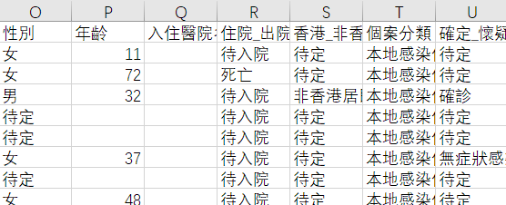

# 爬取香港 Covid 個案的公開數據



*已上傳至 Github，[源代碼](https://github.com/herointene/COVID19_HongKongCases)。2022 年 3 月香港 Omicron BA.2 大爆發后，香港衛生署不再在公開儀表板裏顯示個案，此份爬蟲文件仍可運行但數據僅截至到 2022 年初。*

## 開始爬行

爬取香港衛生署的儀表板網站是通過讀取網站返回的 json 數據進行抓取。

需要的庫：

```python
import requests #解析網站
from urllib.parse import urlencode #get方法的query，用字典的形式自動傳入url的‘query？’後方。
import pandas as pd #轉換成數據表
import time #將數據表文檔用日期命名以便排序
```

接下來非常的簡單，只要傳入與儀表板相同的請求 filter，讀取 json 並轉換成 Dataframe。

```python
def get_page():
    headers = {"user-agent": "Mozilla/5.0 (Windows NT 10.0; Win64; x64) AppleWebKit/537.36 (KHTML, like Gecko) Chrome/84.0.4147.89 Safari/537.36"}
    params = {"f": "json",
              "where": "1=1",
              "returnGeometry": "false",
              "spatialRel": "esriSpatialRelIntersects",
              "outFields": "*",
              "orderByFields": "個案編號 desc",
              "resultOffset": "0",
              "resultRecordCount": "30000",
              "resultType": "standard",
              "cacheHint": "true"
    }
    url='https://services8.arcgis.com/PXQv9PaDJHzt8rp0/arcgis/rest/services/Merge_Display_0227_test_view/FeatureServer/0/query?'+ urlencode(params)
    r = requests.get(url,headers=headers)
    if r.status_code == 200:
        content = r.json()
    return content

def save_to_csv(content):
    cases = content['features']
    df = pd.DataFrame([case.get('attributes')for case in cases])
    date = time.strftime('%d_%m',time.localtime())
    df.to_csv('covid19case_full_{}.csv'.format(date), index=False, encoding='utf-8-sig')  
```

做成 py 文件，以便日後可以讀取：

```python
if __name__ == '__main__':
    print('Starting collect...')
    content = get_page()
    save_to_csv(content)
    print('Successfully saved csv file. The programe will shutdown in 5 seconds.')
    time.sleep(5) #儀式感
    print('done')
```

完成。