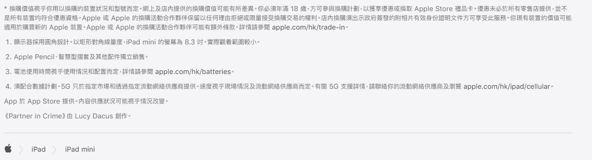

# 如何使用 Markdown 來寫文章

## 基礎操作

使用 Markdown 來寫文章是將文章可以在瀏覽器以你想要的正確的格式渲染呈現出來的必備技能。Markdown 是標記語言，把該風格化的地方、文字用不同的標點符號進行標記，就可以變成不同的形式渲染出來。如在富文本軟件裏（例如 Word），加粗體文字需要選擇文字之後點擊工具欄裏的“B”，而在 markdown 裏需要用 `** **` 框起來。

```md

左邊文字**要加粗的文字**右邊文字

```
顯示為：

左邊文字**要加粗的文字**右邊文字

舉一反三，只要看 markdown 的 [出貓紙](https://github.com/adam-p/markdown-here/wiki/Markdown-Cheatsheet) 進行參照，需要什麽就用什麽，基本的格式就可以掌握，很快就可以根據它來把文章漂亮地展示出來了。

## 在哪裏寫

需要創建一個後綴為 `.md` 的文件。然後用記事本、文字編輯工具或者 Notepad++ 、VS Code 之類可以打開它的編輯器打開。

!!! info
    筆者選擇 VS Code，原因是因爲 Tingzaizuk 的整個工程都在 VS Code 裏完成，而且 VS Code 支持代碼高亮，就算是 md 格式沒有什麽代碼，但標記諸如 #、**、[] 都會進行顔色上的區分。

打開文檔之後便可以開始編寫。文章的開頭總是以 # 開始，它代表了大標題，將來會在頁面的最上方，字體也最大。當然，一篇文章最好只有一個 # 的標題，其餘標題請使用 ## 或 ### 進行層次上的區分。


## 不想琢磨

就算你不想使用任何標記，想呈現的也只是毫無風格的純文字文檔在網頁裏，那麽 mkdocs 也是可以做到的。當你連標題（#）都沒有寫在你的文檔裏的話，mkdocs 會默認把該文檔的文件名字當作是文章的標題。而你可以直接開始正文的編寫。但除了語言考試的作文，我猜大多數情況下一篇文章多多少少都有些小標題或是其它風格的形式，因爲這裏是互聯網，它既然提供了這麽多功能，何不利用起來？

## 格式規範

markdown 并沒有一個統一的格式規範，但在中文漢字與英文夾雜的時候，或是沒有培養普通的文字格式習慣的話，一篇文章會變得不夠整齊，影響美觀。於是，一些規範逐漸被人倡導起來。這裏，我將模仿 Apple 中文官網的文檔規範進行看齊，并且逐步修改以前沒有規範的文章。



在這一張 iPad mini 2021 版的頁尾説明裏，可以發現有幾個明顯的規範準則，且適用於蘋果官網所有頁面：

- 中英文之間需要保留空格
- 優先使用全角符號（例如書名號《》包裹住英文）
- 全角標點相鄰不需要空格
- 半角標點之後需要保留空格（開頭的 *）
- 全角符號與半角符號相鄰，遵循全角符號的規則
- 數字與非數字之間需要空格
- 與數字相關的標點都不空格
- 風格化名詞嚴格使用大小寫

這些範例基本可以覆蓋文檔的 90% 寫作規範，保持良好的書寫習慣心情會十分舒暢。

如果想要有更多的規範，請參閲 [中文文案排版指北](https://github.com/sparanoid/chinese-copywriting-guidelines)，這裏有十分詳細的規範標準，可作爲出貓紙一樣進行參考。

## 現在開始

瞭解了如何用 markdown 格式寫作后，請開始把文章逐步轉移到此文件格式中來。不管你用何種框架，markdown 幾乎都是現在最流行的文檔類標記語言，所有熱門的靜態網頁生成器都在使用它。當完成内容創作後，剩下的事情就十分簡單了。

<br>

