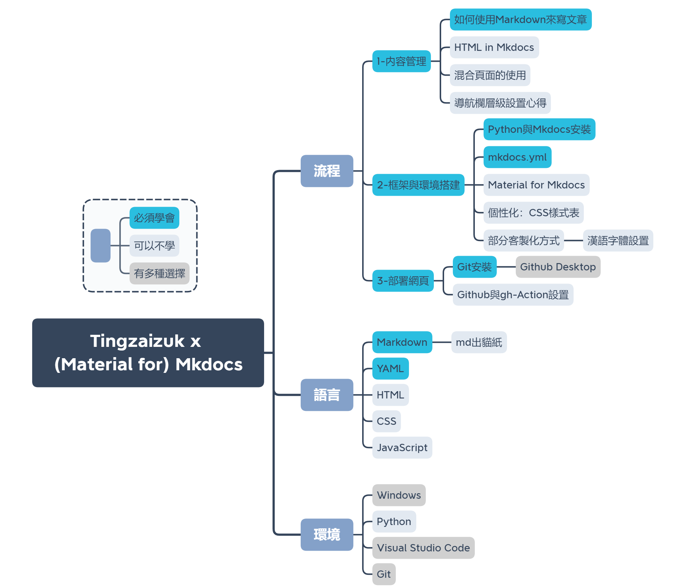

# Material for Mkdocs 個人網站搭建

這篇文章講述了本網站運用 Mkdocs 與其衍生模板框架 Material for Mkdocs 的使用方法之快速導覽，記錄的目的一個在於對自己搭建本網站的經歷進行文字化存檔；另一個在於可讓初學者快速進入工程階段而非在門口徘徊。

並非像其他技術文檔一樣，此分享不會因為想要簡潔與只講重點而去忽視非技術人員的閱讀感受。往下的文章基本上覆蓋了本人在建站遇到的所有問題與可行的步驟，並且使用普通人也可以理解的“閱讀友好”風格。

有任何錯誤或者疑問請隨時電郵告知筆者： 

[Email Me :fontawesome-solid-paper-plane:](mailto:<wulited@outlook.com>){ .md-button }

---

## 快速導覽

Tingzaizuk 是一個靜態網站。它不需要服務器也可以托管在 GitHub 讓 GitHub Pages 啓動網頁。所有的内容在自己電腦上編寫完成後，Mkdocs 會自動打包，並以自動或手動的形式放上 GitHub，傳上互聯網。

建立網站不限於分享技術博客内容，在互聯網進行生活分享、作品分享以及多媒體分享是互聯網繁榮的時代每個追求新事物的人所可以有的生活方式。建立個人專屬網站，内容自己審查，更新自行調整。

想要用建立該網站的框架進行搭建自己的網頁，需要學會 Markdown 格式進行寫作。至於其他服務的安裝以及 config 修改、個性化等内容在所用平臺的文檔裏都有詳盡概述。

- 閲讀官方文檔：
    - Mkdocs: <https://www.mkdocs.org/>
    - Material for Mkdocs: <https://squidfunk.github.io/mkdocs-material/>

- 下載需要用到的東西：
    - VS Code: <https://code.visualstudio.com/>
    - Git / Github Desktop（推薦）: <https://git-scm.com/downloads> & <https://desktop.github.com/>
    - python & Mkdocs: <https://www.anaconda.com/> & <https://www.mkdocs.org/> 

!!! tips
    在開發過程中使用 Anaconda 環境裏的 python，并且接下來的幾乎大部分文章中出現的 “Mkdocs” 其實指代的是其衍生模板 “Material for Mkdocs”。後者目前依舊處於活躍更新狀態，是所有 Mkdocs 中最好的模板之一。

## 學習路綫

學習路綫圖。尚未完全覆蓋但已經完全覆蓋基礎與必備的要點。

## 開始製作

在使用 Mkdocs 時，不要走火入魔（比如本人）。内容才是最重要的，建立個人網頁或作品集網頁尤爲如此。Mkdocs 只是一個使用的工具，它決定了内容呈現的下限；而真正提高上限的是不斷積纍的豐富内容。

本網站會不斷更新學習路綫圖裏的每一個環節，敬請期待。

- 流程
    1. 内容管理
        1. [如何使用 markdown 來寫文章](./md-guide.md)
        2. [HTML in Mkdocs](./mkdocs-html.md)
        3. [混合頁面的使用](./mixedmkdocs.md)
        4. [導航欄層級設置心得](./mkdocs-nav.md)
    2. 框架與環境搭建
        1. [Python與Mkdocs安裝](./mkdocs-python-install.md)
        2. 
        3. 
        4. 
        5. 部分客制化方式：[漢語字體設置](./chnfonts.md)
    3. 部署網頁

 