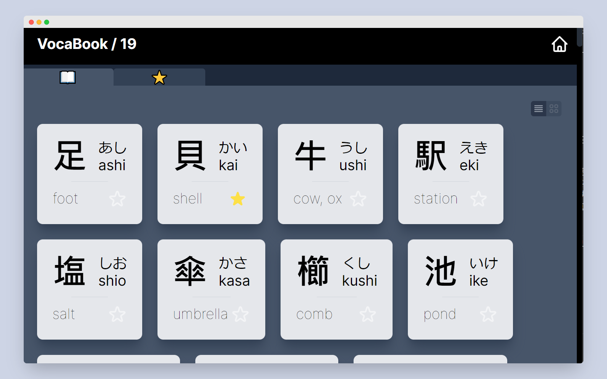
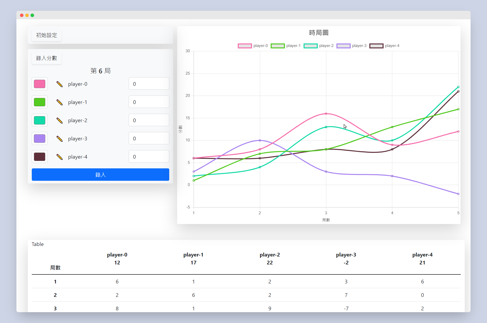
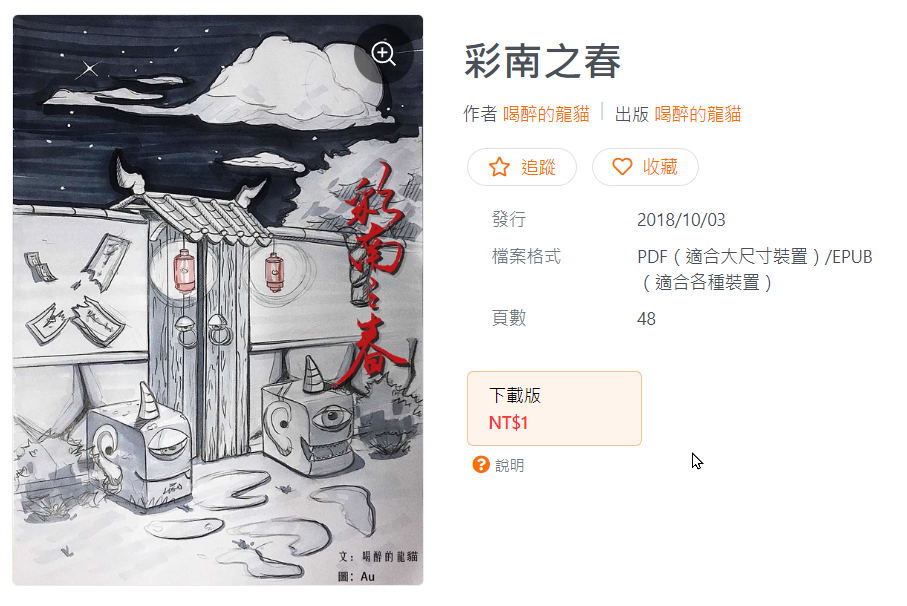

---
hide:
- navigation
---
# Projects Gallery

> 收錄目前所做的一些小作品。

## Music

我的音樂上載于各大音樂平臺，包括:

Apple Music： [link](https://music.apple.com/us/artist/wulited/1649381611)

Spotify： [link](https://open.spotify.com/artist/5j31aItanRjuhtMSPaVqYG)

amazon music: [link](https://music.amazon.com/artists/B0BHYKJT84/wulited)

網易雲音樂：[link](https://music.163.com/#/artist?id=54319144)

當然，我會第一時間發佈到 SoundCloud:

<iframe width="100%" height="300" scrolling="no" frameborder="no" allow="autoplay" src="https://w.soundcloud.com/player/?url=https%3A//api.soundcloud.com/tracks/1438277923&color=%23ff5500&auto_play=false&hide_related=false&show_comments=true&show_user=true&show_reposts=false&show_teaser=true&visual=true"></iframe>

<iframe width="100%" height="300" scrolling="no" frameborder="no" allow="autoplay" src="https://w.soundcloud.com/player/?url=https%3A//api.soundcloud.com/tracks/1359598387&color=%23ff5500&auto_play=false&hide_related=false&show_comments=true&show_user=true&show_reposts=false&show_teaser=true&visual=true"></iframe>

<iframe width="100%" height="300" scrolling="no" frameborder="no" allow="autoplay" src="https://w.soundcloud.com/player/?url=https%3A//api.soundcloud.com/tracks/1350194080&color=%23ff5500&auto_play=false&hide_related=false&show_comments=true&show_user=true&show_reposts=false&show_teaser=true&visual=true"></iframe>

## KanaKill

[Official Website](http://kanakill.netlify.app)

KanaKill 是一個面向中年的日語初學人群設計的五十音隨機選擇器程式。特點是字體大，有語音提示，大人們用了都説好。

## TangoKill

[Official Website](http://tangokill.netlify.app)

TangoKill 是在認識日語五十音之後，開始用五十音來記憶單詞的單詞簿網頁程式。通過 LocalStorage 存儲星標單詞，輕量化的同時提升快速邁過日語初學的門檻。

## Donatcal

[Official Website](https://herointene.github.io/donatcal/withvue)

Donatcal 是我學習前端工程的第一個小型網頁程式。它起初爲了家庭撲克牌分數計算而設置，後來加入了可視化折綫圖表后被其他人用於多種算分游戲中。操作簡單，自由度高。

## 彩南之春

pdf，epub。電子書，短片懸疑小説。

上載于 Pubu，作品詳情頁：[link](https://www.pubu.com.tw/ebook/136677)

>你以為, 你面前呈現的世界,就是你經歷的真實人生嗎?"我"就是這個愛冒險的傢伙,熱心腸的傢伙,想英雄救美的傢伙...
在彩南這個危險的地方,"我"為了尋找走失的女孩潘妮,在一次車禍醒來之後發現自己走進了世外桃源...或者說是..詭異桃源...

---

一些正在做的項目：

## Mkdocs with material 中文教程

[link](../tech/mkdocsbuild.md)

## Tap Water

『再來七杯自來水』

詩集，定期更新欄目。

[link](../poems/preface.md)

## vma

## Morca-uberi

## BentoPomodoro