# 夏日狂欢：用Python爬取Steam排行榜一万个游戏


### 前言


有时候滚动steam的排行榜看自己喜欢的游戏的时候，未免会被右边的价格影响到。久而久之我发现我所不想买的游戏并不是因为它不好玩，而是它还没打折。又或者有些心水未被别人挖掘，在排行榜隐秘的角落里自怨自艾，等待“把玩”它的人出现~

于是我简单的用python爬取了steam排行榜前10000个游戏的信息，其中有游戏名，评价，价格，出版日期等，在更加简洁的列表界面选取自己感兴趣的游戏之时，也可以进行进一步的数据分析。

---
### 开始爬行
先说说这次爬虫选用数据的优缺点：
第一，我发现了steam在显示排行榜列表的时候后台会进行一个查询的申请，点开一看是一串json代码，而且在python进行request的时候不需要模拟浏览器进行填“headers”表的操作。通过访问而得到的json代码大大简化了循环复杂度，一次循环可以得到100个游戏信息。
第二，因为只需要遍历所有json代码，时间上可以比进入每一个游戏链接更加短。
第三，但就因为没有进入每个游戏的链接，所以像评论，简介，开发商等信息就没有爬取。但爬取游戏链接的爬虫攻略网上也有很多，这里就不弄斧了。

首先，进入官网的排行榜页面，为了避免游戏DLC、bundle等影响后期操作的类型出现，记得在右边的过滤器里只勾选游戏类目。
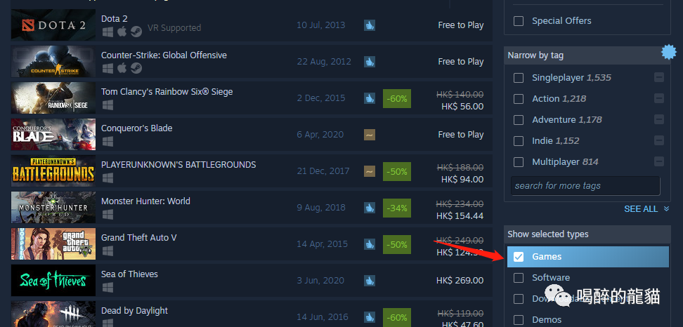

通过后台的XHR发现，页面每次刷新都只显示前50个游戏，当我们滚动页面往下看时，网站会发送一个神秘代码：

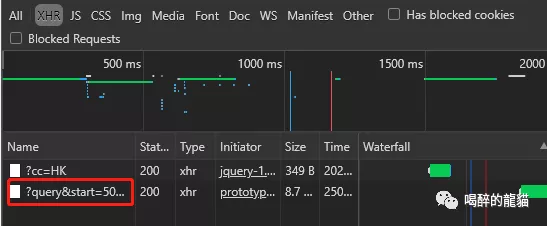

经过观察，我发现代码会自动申请返回从start参数的数字开始，一共count参数的数字的游戏信息。比如，下面的图显示它申请了从第51个到100个总共50个游戏的信息。

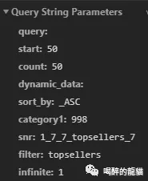

双击上上图的红框链接，返回的页面长这样：

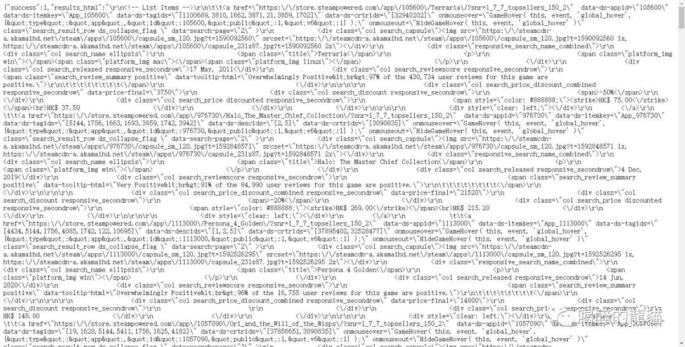

所谓json格式，其实就是在字典里夹字典或者列表，目前许多大数据都是这样保存滴。所以在查询的时候其实很方便，但是我在抽取信息的时候还是会用到正则表达式，因为会方便很多。

知道这些之后，剩下的就可以用python一个个有用信息抽取出来，组成一个新的Dataframe列表，以便之后保存为csv格式。
```python
# 导入需要用到的库
import requests
from bs4 import BeautifulSoup
import re
import json
import numpy as np #不知道会不会用上，但先写上
import pandas as pd
```
我们尝试用requests打开上面json页面的链接，并用json load解析。
这里我更改了start和count 的参数，比较方便对照原网页来看信息是否一致。
```python
url = 'https://store.steampowered.com/search/results/?query&start=0&count=100&dynamic_data=&sort_by=_ASC&category1=998&snr=1_7_7_globaltopsellers_7&filter=globaltopsellers&infinite=1'
content = requests.get(url).content
jsontext = json.loads(content)
soup = BeautifulSoup(jsontext['results_html'],'html.parser')
```
可以看看soup返回的结果，它显示了json里边'results_html'返回的东西，因为前边的内容我们已经不需要了，所有游戏信息都在这个键里边。

接着我们回到那个json页面看看我们想要的东西都藏在哪：
游戏名字藏在span的title class里：

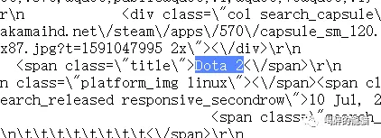

```python
name = soup.find_all('span',class_ ='title')
```
出版日期藏在div的另一个class里：

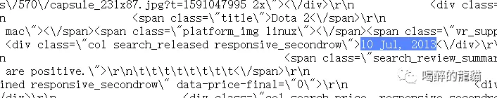

```python
listdate = soup.find_all('div', class_ ='col search_released responsive_secondrow')
```
评分和打分人数藏在span标签里，如果用字典查找的话会比较麻烦，所以我们稍后使用正则表达式将他俩提取出来：

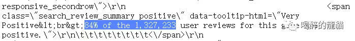

不幸运的是，有些游戏因为还没上架，所以没有人评论，我们用正则表达式得到的信息是乱码。所以我们用函数来防止出现乱码的可能性：
```python
def get_reviewscore(review):
    gamereview=[]
    for i in range(len(review)):    
        try:
            score = re.search('br&gt;(\d\d)%',str(review[i]))[1]
        except:
            score = ''
        gamereview.append(score)
    return gamereview
###########################################
def get_reviewers(review):
    reviewers=[]
    for i in range(len(review)):
        try:
            ppl = (re.search('the\s(.*?)(\s)user',str(review[i]))[1])
        except:
            ppl = ''
        reviewers.append(ppl)
    return reviewers
```
如果看到这里的读者觉得很轻松，那我便可以继续往下述说，因为爬取价格比评论更加麻烦。但仅限于麻烦，并没有很高大上的操作；而我相信我并不是用聪明的方法爬取到想要的结果，因为对于这个体量的数据再优化的代码对于运行时间来说相差不大。反正结果都一样，管他呢。

其实要找物品的最终价格（即免费游戏，打折后或未打折的游戏价格）非常简单，因为他就藏在这里：

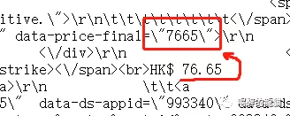

默认后边两位为小数点后两位，所以我们直接把这串数字揪出来并除以100：
```python
def get_finalprice(price):
    finalprice=[]
    for i in range(len(price)):
        pricelist = int(re.search('final(\W+?)(\d+)(\W)',str(price[i]))[2])/100
        finalprice.append(pricelist)
    return finalprice
```
但我们如果就想知道他的原价，以便之后做分析该怎么办呢？

先看一下steam排行榜上的价格有三种显示方法：

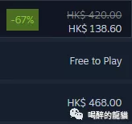

第一种，带有划线价格的打折商品，在源代码中长这样：
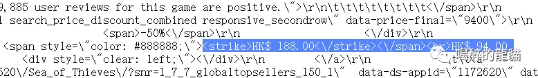

第二种，免费的：
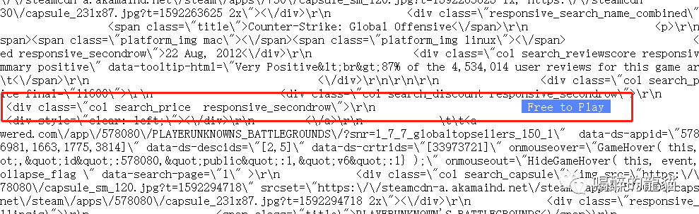

头疼的是，免费的标识也有变体：
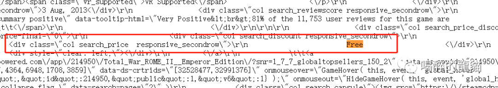

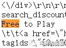

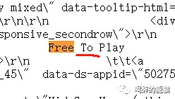

不过Free还是老老实实在最前面，所以我们后边只要找到Free就好啦。

第三种，原价显示：
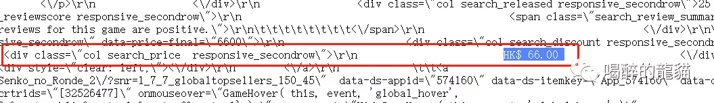

上面的图片都是我在抽查的时候发现的规律与变形，为了避免后续几千个游戏有“乌合之众”，我在代码里只查找这三种格式，如果有奇形怪状的数据出现，直接一棍子打成“空值”：
```python
def get_price(price):
    oripricelist=[]
    for i in range(len(price)):
        try:
            oripricelist.append(price[i].find_all(class_="col search_price responsive_secondrow")[0].text)
        except:
            oripricelist.append(price[i].find_all(class_="col search_price discounted responsive_secondrow")[0].text)

    ori_price=[]
    for i in range(len(oripricelist)):
        try:
            search = re.search('Free',oripricelist[i])[0].replace('Free','0')
        except:
            if oripricelist[i]== '\n':
                search=''
            else:
                try:
                    search = re.search('HK.*?(\d+\.\d+)\D',oripricelist[i])[1]
                except:
                    search=''
        ori_price.append(search)
    return ori_price
```
定义完这些想要的数据之后，我们就开始跑循环了。
先把我们要的数据列命好名字：
```python
def get_data(games=1000): 
    num_games = games
    gamename=[]
    gamereview=[]
    gamereviewers=[]
    gamerelease=[]
    oriprice=[]
    final_price=[]
    appid=[]
    website=[]
```
接着我们以每个链接查询100个游戏的步伐开始跑循环并将里边的信息找出来，录入上面的列表里：
```python
page = np.arange(0,num_games,100)
    for num in page:
        url = 'https://store.steampowered.com/search/results/?query&start='+str(num)+'&count=100&dynamic_data=&sort_by=_ASC&category1=998&snr=1_7_7_globaltopsellers_7&filter=globaltopsellers&infinite=1'
        print('the {} iteration: Trying to connect...'.format((num/100)+1))
        content = requests.get(url).content
        jsontext = json.loads(content)
        soup = BeautifulSoup(jsontext['results_html'],'html.parser')
        name = soup.find_all('span',class_ ='title')
        review = soup.find_all('div', class_ ='col search_reviewscore responsive_secondrow')
        listdate = soup.find_all('div', class_ ='col search_released responsive_secondrow')
        price = soup.find_all('div', class_ = 'col search_price_discount_combined responsive_secondrow')
        href = soup.find_all(class_='search_result_row ds_collapse_flag')
        for i in name:
            gamename.append(i.text)
        getreview = get_reviewscore(review) 
        for i in getreview:
            gamereview.append(i)
        getreviewers = get_reviewers(review)
        for i in getreviewers:
            gamereviewers.append(i)
        for i in listdate:
            gamerelease.append(i.text)
        getprice = get_price(price)
        for i in getprice:
            oriprice.append(i)
        getfinalprice = get_finalprice(price)
        for i in getfinalprice:
            final_price.append(i)
        for i in range(len(href)):
            appid.append(eval(soup.find_all(class_='search_result_row ds_collapse_flag')[i].attrs['data-ds-appid']))
            website.append(soup.find_all(class_='search_result_row ds_collapse_flag')[i].attrs['href'])
        print('done')
```
我们在遍历中每次访问页面、完成每次循环的时候都让电脑打印一段字，以便出错的时候能快速找出出错的页面。

接下来就将得到的数据塞进一个数据表里：
```python
df = pd.DataFrame(data=[gamename,gamereview,gamereviewers,gamerelease,oriprice,final_price,appid,website]).T
    df.columns = ['name','review_score','reviewers','release_date','ori_price','final_price','id','link']
    return df

#呼叫我们的函数：
df = get_data(10000) #这里的数字代表爬取10000个游戏
```
等待漫长的过程与欣赏成功的过程：

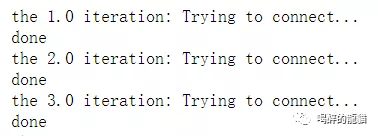

最后的数据集长这样：


---
### 总结与反思
一

我发现final_price也就是一开始提取的最终价格中，会有高于原价的现象。
比如CS：GO的最终价格并不是0，是因为它有一个升级包：

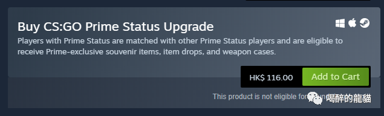

前1000个游戏里总共有3个这样的错误：

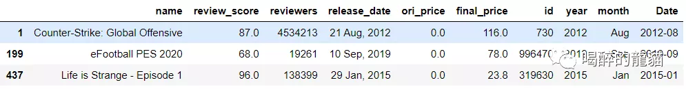

实况足球2020 是demo版免费，而想体验完整游戏确实需要78港币；
奇异人生1 是第一篇章免费，后边的篇章需要23.8港币。

二

这些代码跑起来虽然快，但得到的信息依旧太少，如果要深入研究steam的数据还是需要有强大的耐心遍历所有游戏链接呐。

三

这次的爬虫经历其实也发现了steam一些录入大数据库的时候的小差错，比如前面所提到的免费标识竟然有3种变体，但他们可能觉得问题不大。

终于整理结束，赶紧结尾：
这次的文章就到这里，希望对大家有所帮助~！