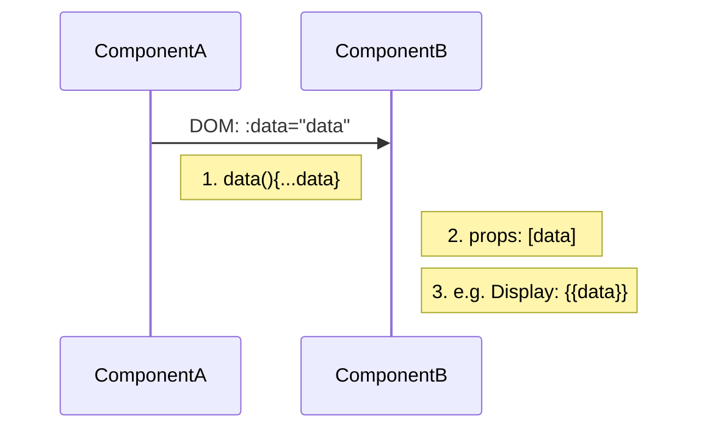
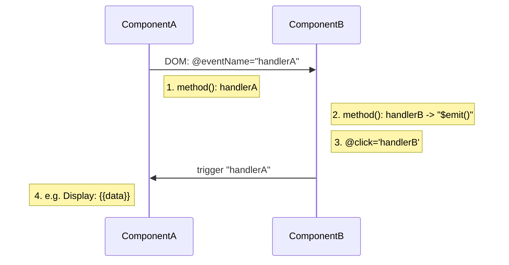

# Vue.js 幾種組件間通信的方法

在 SFC 模式的工程裏面，經常會有同樣的數據需要在不同的組件（Component）之間游蕩，處理用戶交互所應對的數據改變。實際上，在定義好組件的切分之後，我會盡量避免數據亂跑，一來是不好管理，過了一段時間回去看項目發現經常找不到一一對應的數據走向；二來是經常會把各種方法搞混，如果是小工程，大概率不會有相關的文檔可供程序員查閲。但有時候卻一定要面對它，所以我在這裏總結幾個組件之間的相互傳遞數據的方法，當然，Vuex 不在本文的討論範圍内。

## 父組件 傳 子組件

從最簡單的方式開始，就是把所有的數據全部放在父組件中，分別傳遞給各個子組件操作或者顯示于 DOM。傳給子組件的方法是用 `props`配置項。

如下圖:



在父組件中：

=== "Template"
    ```html
    <!-- 在父組件中： -->
    <componentB :data="data" />
    ```
=== "Script"
    ```js
    export default {
      name: 'ComponentA',
      data(){
        return {
          data: [1,2,3]
        }
      }
    }
    ```
在子組件中：

```js
//在子組件中：

export default {
  name: 'ComponentB',
  props:[ data ],
  //...
}
```

這樣，在子組件中就可以獲取到data（1，2，3）。傳入 prop 的其他有關特點，可以去 vue 教程裏查閲: [Vue - Prop](https://vuejs.org/guide/components/props.html)

---

## 子組件 傳 父組件

與上一節内容的傳遞方向相反，在 Vue 的做法裏就麻煩得多。我們需要用到自定義事件進行觸發，同時在兩個組件中都要有函數：子組件的函數用於觸發事件，並傳入數據進入事件之中；父組件的函數用於接收事件觸發傳過來的數據。在父組件裏，當事件觸發時，調用父組件函數；在子組件裏，通過用戶點擊/某些流程（如其他函數觸發)而執行觸發事件的函數。

如下圖：





## 子組件 傳 子組件

當子組件要傳給另一個子組件時，依靠父組件來聯係他們的話會很麻煩。萬一這兩個組件之間有多個父組件、伯伯叔叔嬸嬸姨姨組件互相嵌套的時候，傳數據會變得無敵麻煩。這個時候就需要通過第三方的介入來傳遞數據。本文淺談 “全球事件總綫”與“消息訂閲發佈”兩種方法。兩種方法有同樣的效果，區別是後者需要接入插件，在 SFC 裏 import。

### 全球事件總綫

待學習

### 消息訂閲發佈

待學習