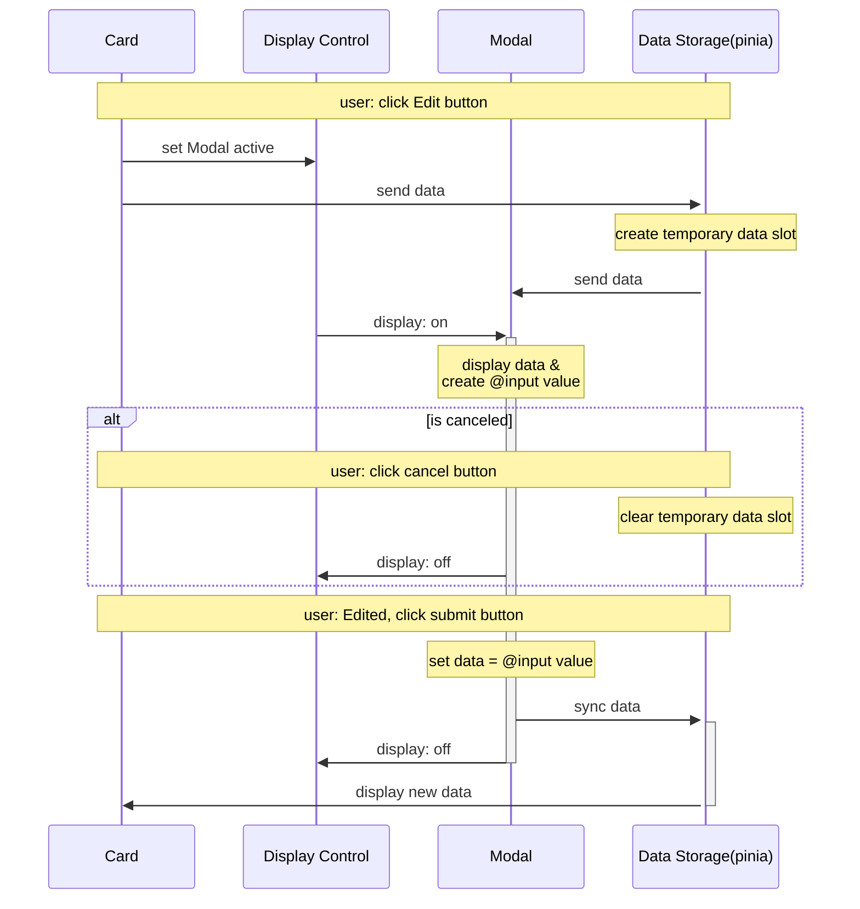

# Vue.js 不加入配置项的编辑功能的实现



由於傳統的編輯功能需要在對象裏添加 `is-edit: boolean` 來控制單個數據的修改，爲了避免添加新數據項進入數據庫，我使用 Modal 也就是彈窗的方式進行更改操作，并且數據庫（pinia）擁有響應式狀態，用戶進行修改之後可以直接刷新 DOM 顯示狀態。

其實可以直接把數據庫的暫存數據連接到彈窗裏的輸入框進行 v-model 雙向綁定，但是我設置了一個取消按鈕在彈窗裏邊讓用戶有反悔的選項。於是我是用 vue 官方整合 v-model 功能的原始方法:

```html
<input
  :value="data"
  @input="event => text = event.target.value">
```

在彈窗的單文件組件裏加入 `text = ref('')`，並將他修改完成后的數據賦予 `data`，但如果用戶沒有修改，該值依舊為空，所以需要再加個條件判斷，如果非空才需要把值賦予給 `data` 讓數據進行同步並刷新 DOM。賦予完值之後記得清空 `text` 防止汙染了下一次修改的程序。